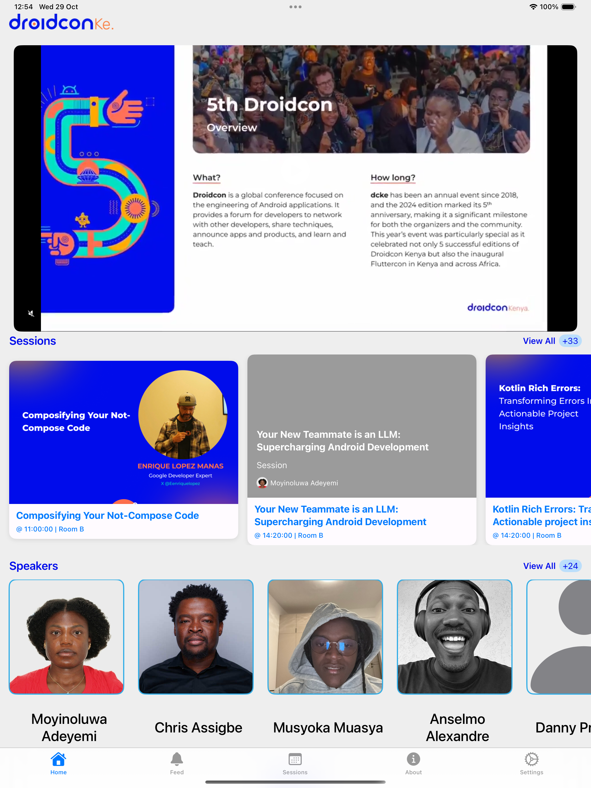
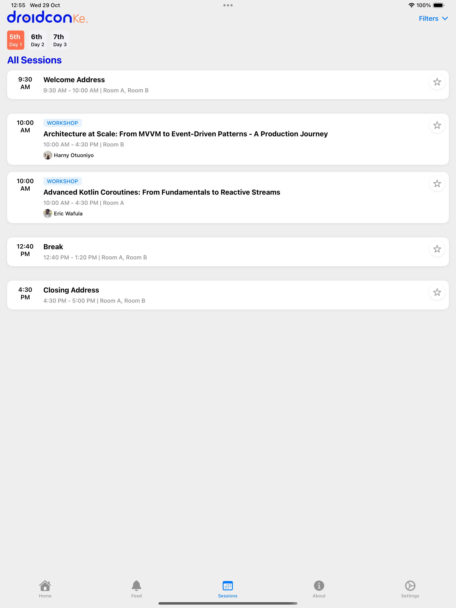

# Droidcon KE 25 🔥🔨

This is the iOS app for the 6th Android Developer conference - Droidcon Kenya to be held in Nairobi on 5th - 7th
November 2025.

This project was written in pure swift! The app supports devices running iOS 15+.

Built with **SwiftUI**, **Core Data**, the app offers an intuitive and fast experience even without an internet connection.

<!-- 
 -->

## 📸 Screenshots
### 1. iPhone
<table>
    <tr>
        <td></td>
        <td></td>
        <td></td>
        <td></td>
    </tr>
</table>

### 1. iPad
<table>
    <tr>
        <td></td>
        <td></td>
        <td></td>
    </tr>
</table>

## Running the Project

To ensure the project runs on your local environment ensure you have iOS 18.5 SDK on your Mac. If you don't have it, you can upgrade to it.

## Dependencies

* **Swift UI** Declarative iOS UI framework
* **[Lottie](https://github.com/airbnb/lottie-ios)** Animation rendering
* **[SVGKIt](https://github.com/SVGKit/SVGKit)** SVG rendering
* **[Swinject](https://github.com/Swinject/Swinject)** Dependency Injection
* **Core Data** Local persistence for offline use

## Architecture

The proposed architecture is as follows;

### Data

This layer will include;

1. Network Calls
2. Caching
3. Storing and fetching Preferences.
4. The repository implementation
5. The relevant data models
6. Relevant Mappers

### Domain

This layer will contain;

1. The repository
2. The relevant domain models.

### Presentation

1. View
2. ViewModels
3. Repositories
4. Relevant Mappers
5. Relevant Models.

## Features

The app will have the following features:

- Sessions
- Feed
- About
- Home
- Speakers
- Sponsors
- Feedback

## Designs

This is the link to the app designs:  
- [Light Theme](https://xd.adobe.com/view/dd5d0245-b92b-4678-9d4a-48b3a6f48191-880e/)
- [Dark Theme](https://xd.adobe.com/view/5ec235b6-c3c6-49a9-b783-1f1303deb1a8-0b91/)

## 💡 Notes

* The app uses Core Data to cache and persist content for offline usage.
* For development and testing, you can mock network calls or pre-load your Core Data store.

## 📄 License

This project is licensed under the MIT License.
